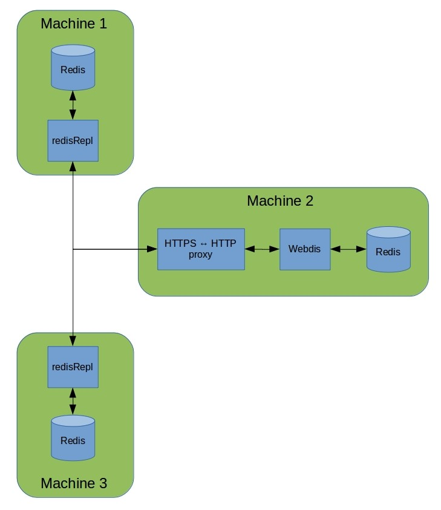

# JaNDER

Exposes api defined in https://github.com/ERIGrid2/JRA-3.1-api.
## Setup instructions

### 1 Environmental variables

Create a .env file and add environmental the following variables:

````
JANDER_VERSION=1.1.0
SERVICE_NAME=JaNDER
PROTOCOL=HTTPS # TCP
PORT_RI=6379
HOST_NAME_RI=localhost
PORT_WEB=8080
HOST_WEB=localhost
NAMESPACE=RSE
REMOTE_ADDRESS=https://ec2-54-72-205-227.eu-west-1.compute.amazonaws.com/redis
````


### 2 Certificates
Certificates are needed to connect to the central node. Contact RSE for certificates release.

Three certificate are needed:
- ca.pem
- XXX.pem
- XXX-key.pem

Save your certificates in a folder _your/cert/location_:

### 3 Docker-compose

Create a docker-compose.yaml file with the following structure (in the same location of the .env file):

````yaml
version: "3.9"
services:
  ri-service:
    build:
      context: .
      dockerfile: Dockerfile
    container_name: "ri-name"
    env_file:
      - .env
    ports:
      - {YOUR_REDIS_PORT}:6379
      - {YOUR_API_PORT}:8080
    secrets:
      - main-cert
      - org-cert
      - org-key

secrets:
  # main org certificate
  main-cert:
    file: your/cert/location/ca.pem
  # your org certificate
  org-cert:
    file: your/cert/location//RSE.pem
  # main org key
  org-key:
    file: your/cert/location/RSE-key.pem


````

Expose redis on YOUR_REDIS_PORT
expose api on YOUR_API_PORT

### 4 Run
Open a terminal and execute the command 
````
docker-compose up -d
````
### RedisRepl

